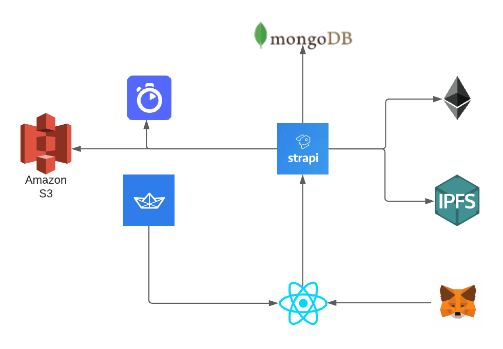

# NFTWorld

## Architecture

## Hosted URLs
- https://nftworld-6a237.web.app (Admin Panel)
- https://nftworld.herokuapp.com (Backend api)

## Reference
- https://github.com/alchemyplatform/nft-minter-tutorial/tree/main/nft-minter
- https://docs.alchemy.com/alchemy/tutorials/how-to-create-an-nft
- https://ethereum.org/en/developers/tutorials/how-to-write-and-deploy-an-nft/
- https://ethereum.org/en/developers/tutorials/how-to-mint-an-nft/#contract-abi
- https://getstream.io/